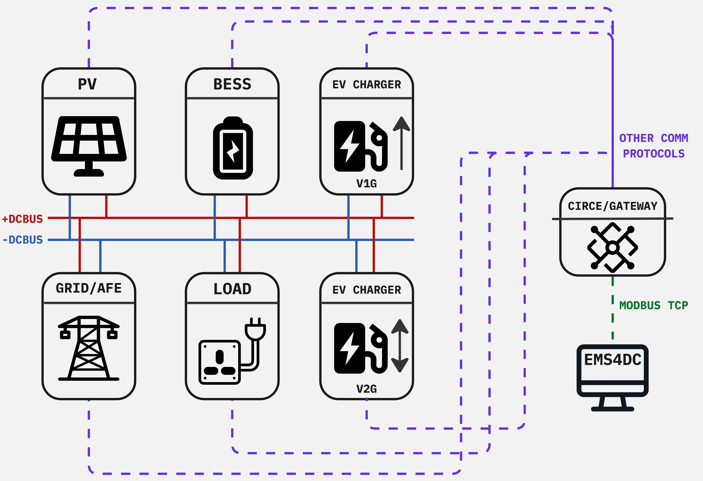

# SHIFT2DC Energy Management System by Eaton
**Developed as part of the SHIFT2DC Project**

## Funding Acknowledgment

This project has received funding from the European Union's Horizon Europe research and innovation programme under grant agreement No. 101136131.

## Documentation
Documentation for the project can be found here:

- [EMS Docs](https://shift2dc.github.io/docs.ems/)

## Architecture
The default high-level architecture for which this EMS is built is depicted on the following figure:

## Project's Structure:
------------
    ├── docs                      <- Contains documentation images
    │
    ├── system-coordination       <- Contains code to manage optimization, database interaction, etc.
    │
    ├── web-app                   <- A Vite + React + Node.js fullstack web app
    │   ├── backend               <- Backend with Node.js/Express.js
    │   └── frontend              <- Frontend Vite + React app
    │  
    ├── .gitignore
    │  
    ├── ems-launcher.bat          <- Batch script which checks if the dependencies were installed and then launches services.
    │
    └── README.md                 
--------

