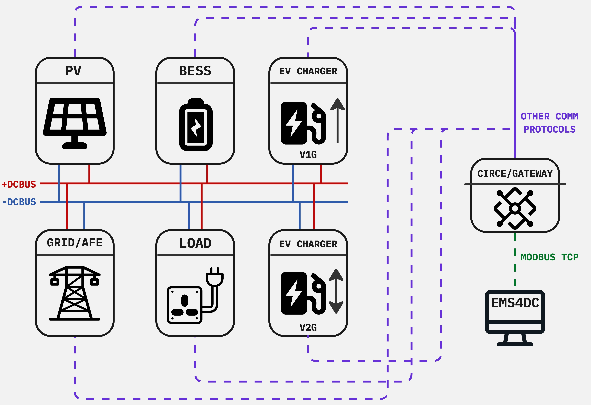

# EMS4DC
EMS4DC is an energy management system developed as part of the SHIFT2DC Project.

## Documentation
Documentation for the project can be found here:

- [EMS4DC Docs](https://shift2dc.github.io/docs.ems/)

## Architecture
The default high-level architecture for which this EMS is built is depicted on the following figure:


## Project's Structure:
```
├── 📁 docs <-------------------------------- Contains documentation images
│   └── 🖼️ high-level-architecture.jpg
├── 📁 system-coordination <----------------- Contains code to manage Python stack
│   ├── 📁 data <---------------------------- Modules for Modbus communication and database queries
│   │   ├── 🐍 __init__.py
│   │   ├── 🐍 database_client.py
│   │   ├── 🐍 measurements_client.py
│   │   └── 🐍 modbus_writer.py
│   ├── 📁 drivers <------------------------- Droop Drivers for individual devices for EMS Droop Operating Mode
│   │   ├── 🐍 __init__.py
│   │   ├── 🐍 afe_driver.py
│   │   ├── 🐍 base_driver.py
│   │   ├── 🐍 bess_driver.py
│   │   └── 🐍 template_driver.py
│   ├── 📁 modes <--------------------------- Implementation of EMS operation in different modes
│   │   ├── 🐍 __init__.py
│   │   ├── 🐍 droop_mode.py
│   │   └── 🐍 optimizer_mode.py
│   ├── 📁 utils <--------------------------- Miscellaneous functions and modules used in system
│   │   ├── 🐍 __init__.py
│   │   ├── 🐍 database_utils.py
│   │   ├── 🐍 logging_utils.py
│   │   ├── 🐍 optimizer_utils.py
│   │   └── 🐍 time_utils.py
│   ├── 🐍 __init__.py
│   ├── 🐍 coordinator.py <------------------ Main module which orchestrates operation of the Python stack
│   └── 📄 requirements.txt
├── 📁 web-app <----------------------------- A Vite + React + Node.js fullstack web app
│   ├── 📁 backend <------------------------- Backend with Node.js/Express.js
│   │   ├── 📁 db <-------------------------- Database module for connection
│   │   │   └── 📄 pool.js
│   │   ├── 📁 routes <---------------------- Routes for handling requests for different pages
│   │   │   ├── 📄 page-charts.js
│   │   │   ├── 📄 page-config.js
│   │   │   ├── 📄 page-debug-optim.js
│   │   │   ├── 📄 page-droop.js
│   │   │   ├── 📄 page-ems.js
│   │   │   ├── 📄 page-home.js
│   │   │   ├── 📄 page-modbus.js
│   │   │   └── 📄 page-sys-info.js
│   │   ├── ⚙️ .env.example
│   │   ├── ⚙️ config.json
│   │   ├── ⚙️ modbus.json
│   │   └── 📄 server.js
│   └── 📁 frontend <------------------------ Frontend Vite + React app
│       ├── 📁 public
│       ├── 📁 src
│       │   ├── 📁 assets
│       │   ├── 📁 components <-------------- Frontend components used across HMI
│       │   │   ├── 📄 DevicesLayout.jsx
│       │   │   ├── 📄 Header.jsx
│       │   │   ├── 📄 Layout.jsx
│       │   │   ├── 📄 PowerFlow.jsx
│       │   │   └── 📄 TurboLink.jsx
│       │   ├── 📁 config
│       │   ├── 📁 hooks
│       │   │   ├── 📄 use-mobile.jsx
│       │   │   └── 📄 use-toast.js
│       │   ├── 📁 lib
│       │   │   └── 📄 utils.js
│       │   ├── 📁 pages <------------------- Contains implementation of individual pages used in HMI
│       │   │   ├── 📄 device-active-front-end.jsx
│       │   │   ├── 📄 device-bidir-ev-charger.jsx
│       │   │   ├── 📄 device-electric-grid.jsx
│       │   │   ├── 📄 device-energy-storage-system.jsx
│       │   │   ├── 📄 device-load.jsx
│       │   │   ├── 📄 device-solar-panels.jsx
│       │   │   ├── 📄 device-unidir-ev-charger.jsx
│       │   │   ├── 📄 page-charts.jsx
│       │   │   ├── 📄 page-config.jsx
│       │   │   ├── 📄 page-droop-curves.jsx
│       │   │   ├── 📄 page-ems-dashboard.jsx
│       │   │   ├── 📄 page-home.jsx
│       │   │   ├── 📄 page-modbus-config.jsx
│       │   │   ├── 📄 page-optimization-debug.jsx
│       │   │   └── 📄 page-sys-info.jsx
│       │   ├── 🎨 App.css
│       │   ├── 📄 App.jsx
│       │   ├── 🎨 index.css
│       │   └── 📄 main.jsx
│       ├── ⚙️ .env.example
│       ├── ⚙️ components.json
│       ├── 📄 eslint.config.js
│       ├── 🌐 index.html
│       ├── ⚙️ jsconfig.json
│       ├── ⚙️ package-lock.json
│       ├── ⚙️ package.json
│       ├── 📄 postcss.config.js
│       ├── 📄 tailwind.config.js
│       └── 📄 vite.config.js
├── ⚙️ .gitignore
├── 📝 CODE_OF_CONDUCT.md
├── 📝 LICENSE.md
├── 📝 README.md
└── 📄 ems-launcher.bat <-------------------- Batch script used for launching the system
```

## Funding Acknowledgment

This project has received funding from the European Union's Horizon Europe research and innovation programme under grant agreement No. 101136131.